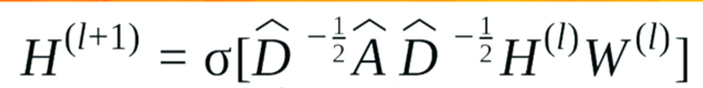
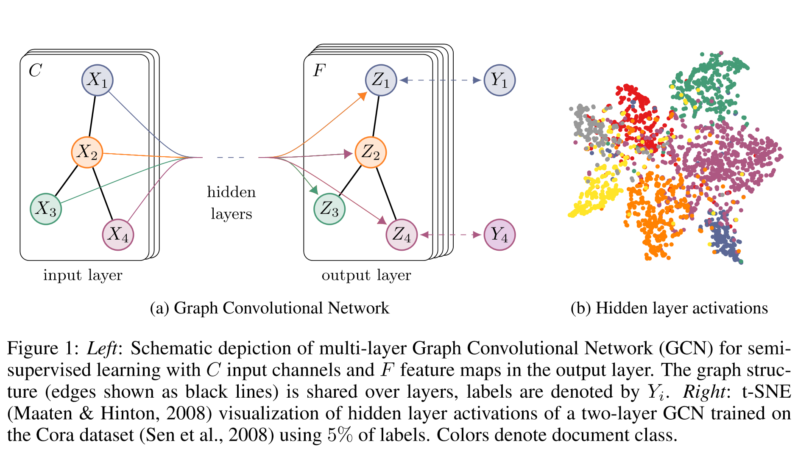
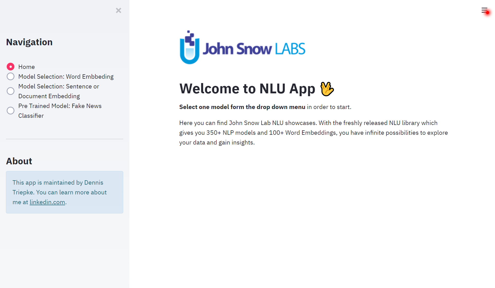
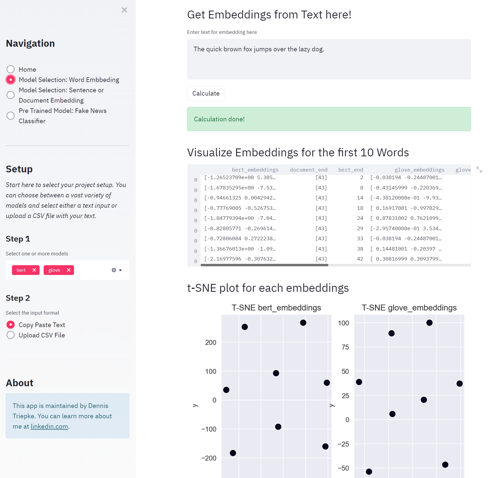

# Dennis Triepke Data Science Portfolio (WIP)

This is a collection of some of my Data Science projects for learning and growing.  

# [Text-based Graph Convolutional Network with tensorflow 1.x](https://github.com/dtriepke/Graph_Convolutional_Network)
- Created the GCN model from the paper  [Graph Convolutional Networks for Text Classification](https://arxiv.org/pdf/1809.05679.pdf)  
- Trained and tested the model with IMDB movie review sentiment classification dataset in a Semi-Supervised approach
  




# [NLU Model Selection App](https://github.com/dtriepke/nlp_model_selection_app)
NLU has created a powerful API for embeddings (and even some NLP downstream-task like sarcasm detection or sentiment classification) in 1-liner of code. However, at the beginning of each NLP projects, you are facing the issue of selecting the model that fits best to your data structure. This app is designed for selecting and comparing pre-trained NLP models from NLU (John Snow Lab) with own data. Whether your project has word, sentence or document embeddings: upload the data, select some pre-trained models and download the embeddings. 

- Model Selection Word Embedding  
- Model Selection Sentence or Document Embedding
- Fake News Classifier




# [Deep Q-Learning (Mountain Car)](https://github.com/dtriepke/Deep_Q_Learning_MountainCar)

This code was designed associated with my master thesis,
"Aspects of Sequential Decision Making Reinforcement Learning and Bandit Problem", Institution for Mathematical Stochastics, Otto-von-Guericke-Universität, 2019. 


The project is about solving a reinforcement problem with an Deep Q-network agent based on the paper et al. Mnih, "Human-level control through deep reinforcement learning", Nature 2015.


### Game Environment

The playbox from `openAI` for developing and comparing reinforcement learning algorithms is the library called `gym`.
This library includes several environments or test problems that can be solved with reinforcement algorithms. 
It provides natural shared interfaces, which enables to skip the complex manual feature engineering. 


This project captures the learning problem `MountainCar`. 
Here is the challenge that a car, stocked between two hills, need to climb the right hill, but a single impulse causes a to less momentum. The only way to solve the problem is that the agent drives front and back in order to generate a stronger momentum. 
Moore first described the problem in his PhD thesis: "Efficient Memory-Based Learning for Robot Control", University of Cambridge, 1990.


This is the `MountainCar` evironment from gym.


The spaces for the action is disrcet and there are 3 possible actions availible.


number | action  
-------|-------  
0      | push left
1      | no operation
2      | push right


The observation is an `2` dimensional vector. The first dimension tells the position of the car and the second the velocity.

number | sate      | vakues
-------|-----------|------------  
i_1t   | position  | [-1.2, 0.6]
i_2t   | velocity  | [-0.07, 0.07]


### Reward 

- The original reward is set to be -1 for each time step except the goal position of 0.5 is reached.

- The mutated reward is adjusted to be i_1t appart from the goal state. Here is the reward set as 10. 


### Terminal State
The terminal state determnines the end of an epsiode and is either the state at time 500 or the the goal state at position 0.5.


# [(simple) NLP Clustering API with Docker](https://github.com/dtriepke/text_clustering_api_with_docker)
Production grade version of a unstructered text clustering application.


## API
The API serves with two endpoints:
 1. localhost:5000/cluster [POST]
    - Args: `col` specify the text column in your input data
    - Args: `no_clusters` specify the number of cluster for kmeans (default = 2)

The api based on `flask`. 

## Docker
For launching the application  with docker use the following commands:
```bash
$ docker pull continuumio/anaconda3 
$ docker build --tag nlp_clustering .    
$ docker run -p 0.0.0.0:5000:5000/tcp --name my_text_clustering_app nlp_clustering  
```

*The last command starts a new docker container*


***
**Credentials**  
This project based on the udemy course Deploy Machine Learning & NLP Models with Dockers (DevOps): https://www.udemy.com/course/deploy-data-science-nlp-models-with-docker-containers/


# [(simple) ML Predict API with Docker](https://github.com/dtriepke/ml_api_with_docker)

This project serves as template for an dockerized flask ML application over two serving methods: local or apache2. The api provides two endpoints, either by file or param directly.

## Random Forest Model
For demo purposes I used the iris data and build a random forest classification model that can predict 3 different types of irises: Setosa, Versicolour, and Virginica. The trainig code is under `model_train.py`.

## API
The API serves with two endpoints:
 1. localhost:5000/predict [GET]
 2. localhost:5000/predict_from_file [POST]

The api based on `flask`. **For api testing and documentation swagger from `flasgger` is used. For more details look in the code.**

## Docker
This project provides two hosting methods `local` and `apache`. For launching the ml api with docker use the following commands:

```bash
 $ docker pull continuumio/anaconda3    
 $ cd ./api_[server method]  
 $ docker build -t iris_predict .   
 $ docker run -p 0.0.0.0:5000:5000/tcp --name my_rl_iris_api iris_predict
 ```

*The last command starts a new docker container*


***
**Credentials**  
This project based on the udemy course Deploy Machine Learning & NLP Models with Dockers (DevOps): https://www.udemy.com/course/deploy-data-science-nlp-models-with-docker-containers/


# [MNIST Image Recognition API with Docker](https://github.com/dtriepke/img_recognition_api_with_docker)
Production grade version of a image recognition application. The MNIST data is one of the most common toy data sets for image classification. Here a CNN was trained to classify handwritten digits with Keras.


## API
The API serves with the endpoints:
 1. localhost:5000/predict_digit [POST] [Key = `image`]

The api based on `flask`. 

## Docker
For launching the application  with docker use the following commands:

```bash
$ docker pull tensorflow/tensorflow     
$ cd api   
$ docker build --tag img_predict . 
$ docker run -p 0.0.0.0:5000:5000/tcp --name img_predict img_predict 
```
*The last command starts a new docker container*


***
**Credentials**  
This project based on the udemy course Deploy Machine Learning & NLP Models with Dockers (DevOps): https://www.udemy.com/course/deploy-data-science-nlp-models-with-docker-containers/

