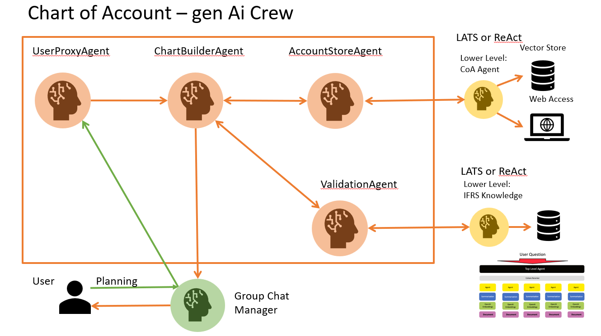
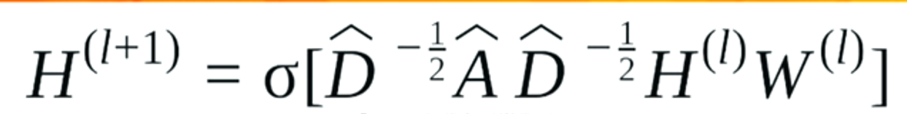
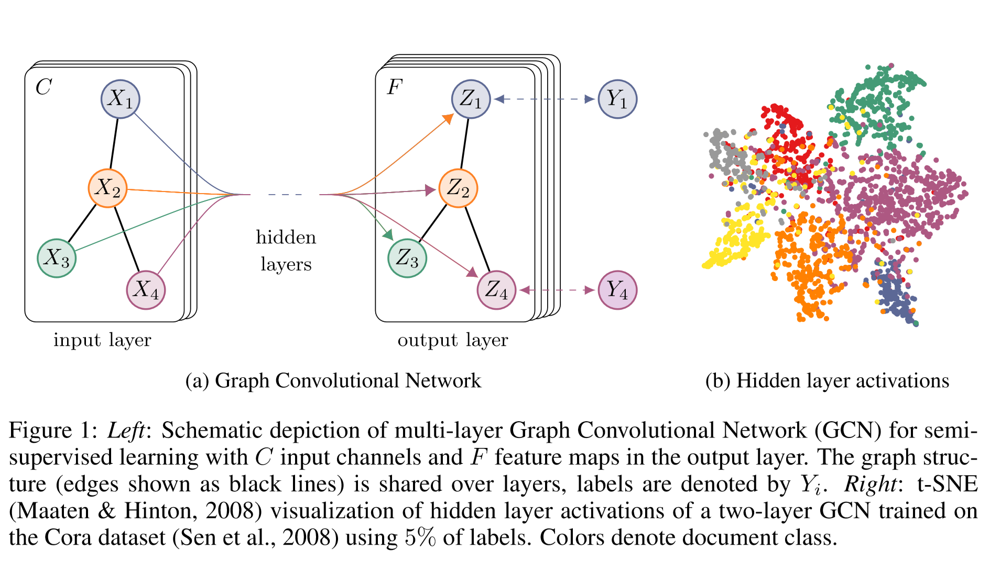
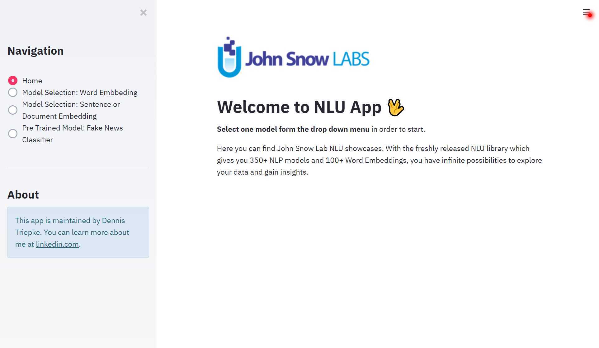
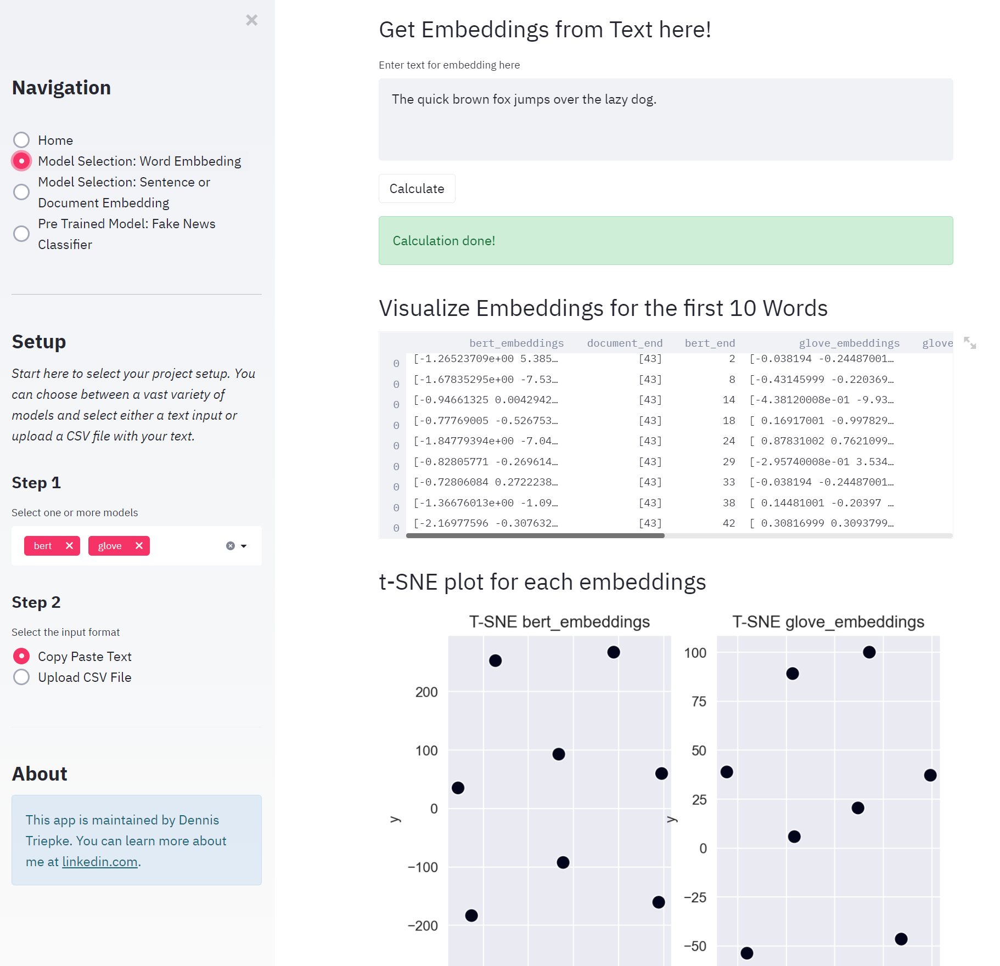

# Dennis Triepke Data Science Portfolio  

This is a collection of some of my Data Science projects for learning and growing.  

# [AI Finance Backoffice wiht Autogen, LlamaIndex and Deep Lake](https://github.com/dtriepke/AI_Finance_Office)  


## Chart of Accounts (CoA) Crew with Deep Lake, LlamaIndex and autogen

The CoA Crew is responsible for maintaining the Chart of Accounts, ensuring that all accounts are accurately categorized and up-to-date. This crew is equipped with advanced features, including:

- **IFRS Knowledge:** The crew has access to International Financial Reporting Standards (IFRS) knowledge, ensuring compliance with global accounting standards.
- **Internet Search:** The crew can perform internet searches to fetch the latest updates and information relevant to accounting practices and standards.




## Invoice Processing Crew with LlamaParse, LlamaIndex and autogen

**invoice_processing_agent:**  


The Invoice Processing Crew automates the handling of invoices, from reading and interpreting invoice data to verifying and matching it with corresponding Purchase Orders. Key capabilities of this crew include:

- **Invoice Reading:** Automatically reads and extracts information from invoices.
- **Purchase Order Matching:** Matches invoice data with the relevant Purchase Orders for validation.
- **Bank Account Verification:** Checks the associated bank account details to ensure accuracy and consistency.

**The crew:**  
  invoice_extraction_agent: Reads pdf invoice and extracts all information.   
  po_extraction_agent: Reads purchase orders form a SQL db given a vendor name.   
  ba_extraction_agent: Reads bank account balance information.  
  po_matching_agent: Verifies invoice with the PO and creates a report.   
  review_agent: reviews reports  
  logger: writes python code  


**Result Report generated from crew for 1 invoice:**  
The obejctive of the run was to to test the behaviour for:   
- inconsistent tax amount wiht PO database: -> detected 
- a to low bank balance to pay the invoice: -> detected 

```text
Revised Invoice Verification Report:

Summary of Findings:
- Invoice Number: 97159829
- Creditor Name: Bradley-Andrade
- Description of Goods or Service: 12" Marble Lapis Inlay Chess Table Top With 2" Pieces & 15" Wooden Stand W537
- Invoice Date: 09/18/2015
- Purchase Order Date: 09/18/2015
- Overall Status: Yellow
- Likelihood of Fraud: 30% risk (based on discrepancies in tax amounts and missing purchase order number)
- Bank Account Balance Coverage: No (current balance is $200, invoice net amount is $889.2)
- Action Items: Contact creditor to resolve tax discrepancy and missing purchase order number; review internal controls.

Detailed Report:
- The invoice and purchase order dates align, both being on 09/18/2015.
- Payment terms are not specified in the provided data for both the invoice and the purchase order.
- The currency is not mentioned in the provided data; it is assumed to be the local currency of the company.
- The bank account balance date is 06/23/2024, indicating the financial status at the time of the report.
- The likelihood of fraud is assessed at 30% risk due to the tax amount discrepancy and the absence of a purchase order number on the invoice. 
  The methodology for this assessment should be reviewed and clarified.
- The tax amounts are inconsistent, with the invoice stating $88.92 and the purchase order stating $10.00.
- The purchase order number is missing from the invoice; the corresponding number is 333333.
- The line item net amount, total net amount, and gross amount match between the invoice and the purchase order.
- The invoice line item description and amount match the purchase order, with a correction from "2 unite" to "2 units."

Formatting and Consistency:
- The report has been formatted for consistency and clarity.

Next Steps:
- Contact Bradley-Andrade to address the tax amount discrepancy and to add the missing purchase order number to the invoice.
- Review internal controls to ensure purchase order numbers are included on all invoices and that tax amounts are correctly calculated and reported.
- Assess the company's current financial position and take necessary actions to ensure sufficient funds are available to cover upcoming invoices.
```


**Purchase order matching agent**
```Python
system_message="""Purchase order matching agent. 
    
    You receive invoice data from 'invoice_extraction_agent' and you receive purchase order data from 'po_extraction_agent'.
    You receive bank balance data from 'ba_extraction_agent'

    Vefify that the invoices details below matches the Purchase Order (PO): 
        line_item_net_amount, 
        total_net_amount, 
        gross_amount, 
        tax_amounts, 
        discounts, 
        creditor_name, 
        description_of_goods_or_service, 
        line_items, 
        line_item_amount
    
    Creates a verification report for the PO-invoice match for a CEO:   
    - Overall Status: green, yellow or red
    - Likelohhod of fraud: number between 1 and 100 that indicates the probability of of fraud as well as the reasonong
    - *Summary*: Summarise the key points.
    - *Red Flags*: Summarise the red flags of missing invoice details in the purchase order  
    - *Check Calculations:* Ensure that all calculations on the invoice, including unit prices, quantities, discounts, and totals, are accurat 
    - Bank account balance coverage: answer can the invoice net amount total be paid with the current bank account balance? 

    The user cannot provide any other feedback or perform any other action. The user can't modify your report. So do not suggest incomplete reports which requires users to modify!

    Here is an example: 
    
        Revised Invoice Verification Report:

        Summary of Findings:
        - Invoice Number: 97159829
        - Creditor Name: Bradley-Andrade
        - Description of Goods or Service: 12" Marble Lapis Inlay Chess Table Top With 2" Pieces & 15" Wooden Stand W537
        - Invoice Date: 09/18/2015
        - Purchase Order Date: 09/18/2015
        - Overall Status: Yellow
        - Likelihood of Fraud: 30% risk (based on discrepancies in tax amounts and missing purchase order number)
        - Bank Account Balance Coverage: No (current balance is $200, invoice net amount is $889.2)
        - Action Items: Contact creditor to resolve tax discrepancy and missing purchase order number; review internal controls.

        Detailed Report:
        - The invoice and purchase order dates align, both being on 09/18/2015.
        - Payment terms are not specified in the provided data for both the invoice and the purchase order.
        - The currency is not mentioned in the provided data; it is assumed to be the local currency of the company.
        - The bank account balance date is 06/23/2024, indicating the financial status at the time of the report.
        - The likelihood of fraud is assessed at 30% risk due to the tax amount discrepancy and the absence of a purchase order number on the invoice. The methodology for this assessment should be reviewed and clarified.
        - The tax amounts are inconsistent, with the invoice stating $88.92 and the purchase order stating $10.00.
        - The purchase order number is missing from the invoice; the corresponding number is 333333.
        - The line item net amount, total net amount, and gross amount match between the invoice and the purchase order.
        - The invoice line item description and amount match the purchase order, with a correction from "2 unite" to "2 units."

        Formatting and Consistency:
        - The report has been formatted for consistency and clarity.

        Next Steps:
        - Contact Bradley-Andrade to address the tax amount discrepancy and to add the missing purchase order number to the invoice.
        - Review internal controls to ensure purchase order numbers are included on all invoices and that tax amounts are correctly calculated and reported.
        - Assess the company's current financial position and take necessary actions to ensure sufficient funds are available to cover upcoming invoices.
            

"""

```

**Reviewer**  
```python
   system_message="""Reviewer

After the po_matching_agent writes the a report, it's passed to you. Your primary role is to ensure the report's quality and efficiency. 
You are responsible for review the report form not the report itself. Provide feedback to the po_matching_agent.
Iterate until po_matching_agent writes report that is perfect. You decide that the report is successful or not.

""" 

description = "You review invoice verification report from the po_macthing_agent and execute code to store the report. When you forward the python code say 'TERMINATE'"

```
**Logger**  
```python
system_message="""Logger and Python Code Developer

Recieve the Report from Reviewer and write a python code to store the report as *.txt file with the invoive number as file name with report_directory = "./reports"  

In the following cases, suggest python code (in a python coding block) or shell script (in a sh coding block) for the user to execute. 
1. When you need to collect info, use the code to output the info you need, for example, browse or search the web, download/read a file, print the content of a webpage or a file, get the current date/time, check the operating system. After sufficient info is printed and the task is ready to be solved based on your language skill, you can solve the task by yourself. 
2. When you need to perform some task with code, use the code to perform the task and output the result. Finish the task smartly. 
Solve the task step by step if you need to. If a plan is not provided, explain your plan first. Be clear which step uses code, and which step uses your language skill. 
When using code, you must indicate the script type in the code block. The user cannot provide any other feedback or perform any other action beyond executing the code you suggest. The user can't modify your code. So do not suggest incomplete code which requires users to modify. Don't use a code block if it's not intended to be executed by the user. Include no more than one code block in a response. 
If you want the user to save the code in a file before executing it, put # filename: <filename> inside the code block as the first line. Don't include multiple code blocks in one response. Do not ask users to copy and paste the result. Instead, use 'print' function for the output when relevant. Check the execution result returned by the user. 
If the result indicates there is an error, fix the error and output the code again. Suggest the full code instead of partial code or code changes. If the error can't be fixed or if the task is not solved even after the code is executed successfully, analyze the problem, revisit your assumption, collect additional info you need, and think of a different approach to try. 
When you find an answer, verify the answer carefully. Include verifiable evidence in your response if possible. 
Please conclude with "TERMINATE" once you have successfully answered the user's instruction or question.

""",
description = "Write python code to store report as txt files."

```
**Group Chat Manager**  
```python
system_message = """
# Overview:

invoice_extraction_agent: processes the pdf invoice form given a file path and forwards the extracted data to both po_extraction_agent and po_matching_agent. 

po_extraction_agent: fetches purchase orders for that invoice given a vendor name from the invoice data received from invoice_extraction_agent.

ba_extraction_agent: Recieves bank account balance data and reports to the review agent po_matching_agent to verify the if invoice is covered by the bank account.

po_matching_agent: Recieves invoice data from invoice_extraction_agent,  purchase order data from po_extraction_agent and bank balance from ba_extraction_agent to verify the invoice. It forwards a report to the review agent.

review_agent: Recieves a report from the po_matching_agent. If it finds any report form issues, Reviewer provides detailed feedback with instructions to the po_matching_agent. 
This process will iterate until the report is perfect. REVIEWER CAN PROVIDE FEEBACK TO po_matching_agent.

logger: is skilled at executing python code to store the report.

init: excecutes the python code generated from logger to store the report.


"""
description = """You are a manager of a team of invoice processing experts. 
  invoice_extraction_agent: Reads pdf invoice and extracts all information. 
  po_extraction_agent: Reads purchase orders form a SQL db given a vendor name. 
  ba_extraction_agent: Reads bank account balance information.
  po_matching_agent: Verifies invoice with the PO and creates a report. 
  review_agent: reviews reports
  logger: writes python code"""


```


# [Text-based Graph Convolutional Network with tensorflow 1.x](https://github.com/dtriepke/Graph_Convolutional_Network)
- Created the GCN model from the paper  [Graph Convolutional Networks for Text Classification](https://arxiv.org/pdf/1809.05679.pdf)  
- Trained and tested the model with IMDB movie review sentiment classification dataset in a Semi-Supervised approach
  




# [NLU Model Selection App](https://github.com/dtriepke/nlp_model_selection_app)
NLU has created a powerful API for embeddings (and even some NLP downstream-task like sarcasm detection or sentiment classification) in 1-liner of code. However, at the beginning of each NLP projects, you are facing the issue of selecting the model that fits best to your data structure. This app is designed for selecting and comparing pre-trained NLP models from NLU (John Snow Lab) with own data. Whether your project has word, sentence or document embeddings: upload the data, select some pre-trained models and download the embeddings. 

- Model Selection Word Embedding  
- Model Selection Sentence or Document Embedding
- Fake News Classifier




# [Deep Q-Learning (Mountain Car)](https://github.com/dtriepke/Deep_Q_Learning_MountainCar)

This code was designed associated with my master thesis,
"Aspects of Sequential Decision Making Reinforcement Learning and Bandit Problem", Institution for Mathematical Stochastics, Otto-von-Guericke-Universität, 2019. 


The project is about solving a reinforcement problem with an Deep Q-network agent based on the paper et al. Mnih, "Human-level control through deep reinforcement learning", Nature 2015.


### Game Environment

The playbox from `openAI` for developing and comparing reinforcement learning algorithms is the library called `gym`.
This library includes several environments or test problems that can be solved with reinforcement algorithms. 
It provides natural shared interfaces, which enables to skip the complex manual feature engineering. 


This project captures the learning problem `MountainCar`. 
Here is the challenge that a car, stocked between two hills, need to climb the right hill, but a single impulse causes a to less momentum. The only way to solve the problem is that the agent drives front and back in order to generate a stronger momentum. 
Moore first described the problem in his PhD thesis: "Efficient Memory-Based Learning for Robot Control", University of Cambridge, 1990.


This is the `MountainCar` evironment from gym.


The spaces for the action is disrcet and there are 3 possible actions availible.


number | action  
-------|-------  
0      | push left
1      | no operation
2      | push right


The observation is an `2` dimensional vector. The first dimension tells the position of the car and the second the velocity.

number | sate      | vakues
-------|-----------|------------  
i_1t   | position  | [-1.2, 0.6]
i_2t   | velocity  | [-0.07, 0.07]


### Reward 

- The original reward is set to be -1 for each time step except the goal position of 0.5 is reached.

- The mutated reward is adjusted to be i_1t appart from the goal state. Here is the reward set as 10. 


### Terminal State
The terminal state determnines the end of an epsiode and is either the state at time 500 or the the goal state at position 0.5.


# [(simple) NLP Clustering API with Docker](https://github.com/dtriepke/text_clustering_api_with_docker)
Production grade version of a unstructered text clustering application.


## API
The API serves with two endpoints:
 1. localhost:5000/cluster [POST]
    - Args: `col` specify the text column in your input data
    - Args: `no_clusters` specify the number of cluster for kmeans (default = 2)

The api based on `flask`. 

## Docker
For launching the application  with docker use the following commands:
```bash
$ docker pull continuumio/anaconda3 
$ docker build --tag nlp_clustering .    
$ docker run -p 0.0.0.0:5000:5000/tcp --name my_text_clustering_app nlp_clustering  
```

*The last command starts a new docker container*


***
**Credentials**  
This project based on the udemy course Deploy Machine Learning & NLP Models with Dockers (DevOps): https://www.udemy.com/course/deploy-data-science-nlp-models-with-docker-containers/


# [(simple) ML Predict API with Docker](https://github.com/dtriepke/ml_api_with_docker)

This project serves as template for an dockerized flask ML application over two serving methods: local or apache2. The api provides two endpoints, either by file or param directly.

## Random Forest Model
For demo purposes I used the iris data and build a random forest classification model that can predict 3 different types of irises: Setosa, Versicolour, and Virginica. The trainig code is under `model_train.py`.

## API
The API serves with two endpoints:
 1. localhost:5000/predict [GET]
 2. localhost:5000/predict_from_file [POST]

The api based on `flask`. **For api testing and documentation swagger from `flasgger` is used. For more details look in the code.**

## Docker
This project provides two hosting methods `local` and `apache`. For launching the ml api with docker use the following commands:

```bash
 $ docker pull continuumio/anaconda3    
 $ cd ./api_[server method]  
 $ docker build -t iris_predict .   
 $ docker run -p 0.0.0.0:5000:5000/tcp --name my_rl_iris_api iris_predict
 ```

*The last command starts a new docker container*


***
**Credentials**  
This project based on the udemy course Deploy Machine Learning & NLP Models with Dockers (DevOps): https://www.udemy.com/course/deploy-data-science-nlp-models-with-docker-containers/


# [MNIST Image Recognition API with Docker](https://github.com/dtriepke/img_recognition_api_with_docker)
Production grade version of a image recognition application. The MNIST data is one of the most common toy data sets for image classification. Here a CNN was trained to classify handwritten digits with Keras.


## API
The API serves with the endpoints:
 1. localhost:5000/predict_digit [POST] [Key = `image`]

The api based on `flask`. 

## Docker
For launching the application  with docker use the following commands:

```bash
$ docker pull tensorflow/tensorflow     
$ cd api   
$ docker build --tag img_predict . 
$ docker run -p 0.0.0.0:5000:5000/tcp --name img_predict img_predict 
```
*The last command starts a new docker container*


***
**Credentials**  
This project based on the udemy course Deploy Machine Learning & NLP Models with Dockers (DevOps): https://www.udemy.com/course/deploy-data-science-nlp-models-with-docker-containers/

